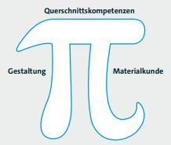

# Rollenideal Digital Designer
Analog zum Architekten im Bauwesen und zum Industriedesigner ergibt sich aus der Definition des Digital Designers ein breit angelegtes und anspruchsvolles Kompetenzprofil und ein breites Querschnittskompetenzfeld. Die Rolle des Digital Designers geht über die Rolle der "User Experience Designer" hinaus, die in einigen Unternehmen bereits etabliert ist. Das Kompetenzprofil des Digital Designers besteht aus den zwei Schwerpunkten Gestaltung und Materialkunde. Im Vergleich zum "User Experience Designer" finden sich im Schwerpunkt "Materialkunde" des Digital Designers deutlich mehr technische Aspekte. In den Querschnittskompetenzfeldern weist der Digital Designer deutlich mehr Kompetenzen in den Methoden und Vorgehensweisen zur Entwicklung von Software auf. Die zwei Schwerpunkte zusammen mit der Querschnittskompetenz ergeben das sogenannte pi-shaped Profil. Daher auch das pi als Titelbild. Im Gegensatz dazu stehen die bekannten sogenannten T-shaped Profile mit einem Schwerpunkt und einer Querschnittskompetenz. Diese Form des Kompetenzschnitt ist, wie in diesem Bericht gezeigt, für die Herausforderungen der Digitalisierung und der Digitalen Transformation nicht ausreichend. Es braucht zwei Schwerpunkte als Standbeine und ein breites Querschnittsprofil:

## Schwerpunkt 1 – Gestaltung
- Arbeit mit Anforderungen (Requirements Engineering)  
- Konstruktion von Benutzungsschnittstellen (Usability Engineering/Interaction Design)  
- Grundlegende Vorgehensweisen zur Gestaltung  
- Entwerfen neuer Konzepte  
- Explorationsfähigkeit, Fähigkeit zur Durchführung ethnografischer Feldforschung  
- Menschenzentriertheit  

## Schwerpunkt 2 – Materialkunde
- Wissen um die Möglichkeiten und Grenzen von Software und Hardware  
- Wissen um Algorithmen und Grenzen von Algorithmen  
- Arten von Systemen: Informationssysteme, Eingebettete Systeme  
- Arten von Endgeräten: Desktop, Notebook, Tablet, Smartphone, etc.  
- Interaktionsformen: Tastatur, Maus, Touch, Sprache, Geste, etc.  
- Wissen über den grundsätzlichen Aufbau von Software (Software-Architekturen)  
- Wissen um Form- und Farbgebung  

## Querschnittskompetenz  
- Wissen um Methoden und Vorgehensweisen zum Management von Entwicklungsvorhaben  
- Wissen um Methoden und Vorgehensweisen zur Entwicklung von Software  
- Wirtschaftliche Aspekte zur Gestaltung/Entwicklung von Software  
- Fähigkeit zum Arbeiten in interdisziplinären Projekten  
- Psychologische Grundlagen zur Realisierung von Software auf Nutzer- und Herstellerseite  